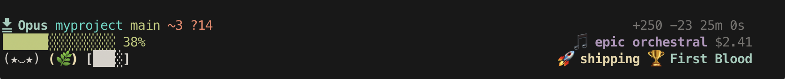
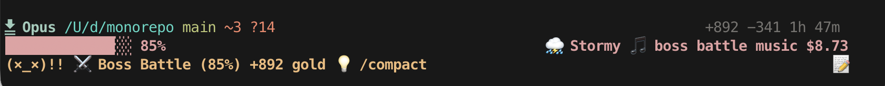
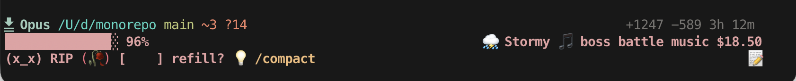
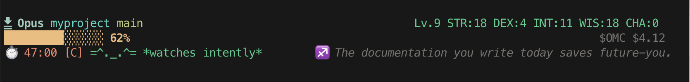
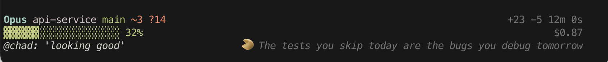
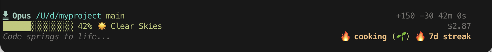
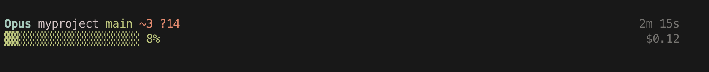

# oh-my-claude

**Like oh-my-zsh, but for Claude Code.** An extensible statusline framework with themes and plugins.

[](https://www.npmjs.com/package/@npow/oh-my-claude)
[](https://github.com/npow/oh-my-claude/actions/workflows/ci.yml)
[](LICENSE)
[](package.json)

## Install

```bash
npm install -g @npow/oh-my-claude
omc install
```

Restart Claude Code and you're done.

---

## Pick your vibe

### `tamagotchi` -- virtual pet, growing garden, draining coffee



`{ "theme": "tamagotchi" }`

---

### `boss-battle` -- dungeon crawl with weather and battle music



`{ "theme": "boss-battle" }`

---

### `danger-zone` -- 3 hours in, $18 spent, everything on fire



`{ "theme": "danger-zone" }`

---

### `rpg` -- D&D character sheet, speedrun timer, cat companion



`{ "theme": "rpg" }`

---

### `coworker` -- fake Slack messages and fortune cookie wisdom



`{ "theme": "coworker" }`

---

### `narrator` -- third-person text adventure with vibes



`{ "theme": "narrator" }`

---

### `default` -- clean and informative, no config needed



---

Run `npm run showcase` to see all themes live in your terminal.

---

## 41 segments, mix and match

### Have fun while you wait

| Segment | What it does | Example |
|---------|--------------|---------|
| `tamagotchi` | Virtual pet reacts to your session | `(^.^)` happy, `(x_x) RIP` at 95% context |
| `cat` | A cat doing cat things | `=^._.^= *sits on context window*` |
| `vibe-check` | One-word session mood | `vibing`, `cooking`, `burning cash` |
| `fortune-cookie` | Rotating developer wisdom | `"Weeks of coding can save hours of planning"` |
| `narrator` | Third-person text adventure | `The walls close in...` |
| `soundtrack` | Music genre for the moment | `lo-fi beats`, `boss battle music` |
| `garden` | ASCII plants grow as you code | `(.)` seed to `(🌳)` at 500 lines |
| `coffee-cup` | Drains over a 2-hour session | `[████]` full to `[    ] refill?` |
| `horoscope` | Daily coding horoscope | `Mercury is in retrograde. Avoid force-pushing.` |
| `coworker` | Fake Slack reactions | `@chad: 'ship it already'` |
| `commit-msg` | Suggested commit message | `git commit -m "feat: rewrite the entire codebase"` |
| `weather-report` | Session as weather forecast | `Clear Skies`, `Stormy` at 85% context |

### Gamify your session

| Segment | What it does | Example |
|---------|--------------|---------|
| `achievement` | Unlockable badges | `Centurion` at 100 lines, `Whale` at $20 |
| `rpg-stats` | D&D character sheet | `Lv.9 STR:18 DEX:4 INT:11 WIS:18 CHA:0` |
| `speedrun` | Timer + efficiency rating | `47:00 [C]` |
| `streak` | Consecutive-day streak | `🔥 7d streak` |
| `battle-log` | Session as dungeon crawl | `Boss Battle (85%) +892 gold` |
| `stock-ticker` | Cost as stock price | `$OMC ▲▲ $4.56` |
| `emoji-story` | Growing emoji narrative | `📝✏️🏗️💰⏳` |

### Stay productive

| Segment | What it shows | Example |
|---------|---------------|---------|
| `context-bar` | Visual context progress bar | `██████░░░░░░░░░ 38%` |
| `context-percent` | Context usage as number | `38%` |
| `context-tokens` | Token count used/total | `84k/200k` |
| `session-cost` | Session cost in USD | `$2.41` |
| `cost-budget` | Cost vs budget | `$3.50/$10.00` |
| `git-branch` | Current branch | `main` |
| `git-status` | Staged, modified, untracked | `+2 ~1 ?3` |
| `lines-changed` | Lines added/removed | `+250 -23` |
| `smart-nudge` | Contextual suggestions | `💡 /compact` at 75%, `💡 commit?` at 100 lines |
| `token-sparkline` | Context history sparkline | `▁▂▃▄▅▆▇█` |
| `model-name` | Current model | `Opus` |
| `directory` | Working directory | `myproject` |
| `session-timer` | Session duration | `25m 0s` |
| `api-timer` | API wait time | `api 3m 40s` |
| `vim-mode` | Vim mode indicator | `NORMAL` |
| `version` | Claude Code version | `v2.1.34` |

### Layout building blocks

| Segment | Purpose |
|---------|---------|
| `separator-pipe` | Pipe `│` between segments |
| `separator-arrow` | Powerline arrow separator |
| `separator-space` | Whitespace |
| `flex-space` | Right-alignment marker |
| `custom-text` | Static text string |
| `output-style` | Active output style |

---

## Context bar changes color as it fills

```diff
  ██████░░░░░░░░░ 30%     ← green, you're fine
! █████████░░░░░░ 60%     ← yellow, heads up
- ████████████░░░ 80%     ← red, time to /compact
```

Cost tracking auto-detects your plan (Pro/Max) and warns at the right thresholds.

---

## 9 themes

### Built-in layouts

**default** -- two lines, works everywhere:
```
 Opus myproject main +2 ~1                                    +83 -21 15m 0s
 ▓▓▓▓▓▓▓░░░░░░░░░░░░░ 35%                                         $1.23
```

**minimal** -- single line, text only:
```
 myproject · main +2 ~1                                       35% · $1.23
```

**powerline** -- Nerd Font icons and arrows:
```
 󰧩 Opus  ~/c/myproject  main +2 ~1                    +83 -21  15m 0s
 ███████░░░░░░░░ 35% 84k/200k                           $1.23 NORMAL
```

### Personality themes

| Theme | Vibe |
|-------|------|
| **tamagotchi** | Pet, garden, coffee, vibes |
| **boss-battle** | Dungeon crawl, weather, soundtrack |
| **rpg** | D&D stats, speedrun, cat, horoscope |
| **coworker** | Fake Slack messages, fortune cookies |
| **danger-zone** | Everything on fire |
| **narrator** | Third-person text adventure |

See [screenshots above](#pick-your-vibe) for each theme in action.

---

## Add your own segment

No fork needed. Plugins live in their own directory:

```bash
omc create my-segment
```

Creates `~/.claude/oh-my-claude/plugins/my-segment/segment.js`:

```js
export const meta = {
  name: 'my-segment',
  description: 'My custom segment',
  requires: [],
  defaultConfig: {},
};

export function render(data, config) {
  return { text: 'Hello!', style: 'cyan' };
}
```

Add it to your theme, restart Claude Code, done. Three rules: export `meta`, export `render`, return `{ text, style }` or `null`.

Full data field reference: [docs/segment-contract.md](docs/segment-contract.md)

**Share your segment:** PR it into `src/segments/` or post your `segment.js` anywhere -- others drop it in their plugins directory.

---

## CLI

```
omc install               Interactive setup wizard
omc create <name>         Scaffold a new plugin segment
omc themes                List available themes
omc list                  List all 41 segments
omc validate              Check segment contract compliance
omc uninstall             Remove from Claude Code
```

---

## Requirements

- Node 18+ (ships with Claude Code)
- Zero npm dependencies

## Contributing

PRs welcome. One file per segment, export `meta` + `render`, handle nulls, run `npm run validate`.

## License

MIT
