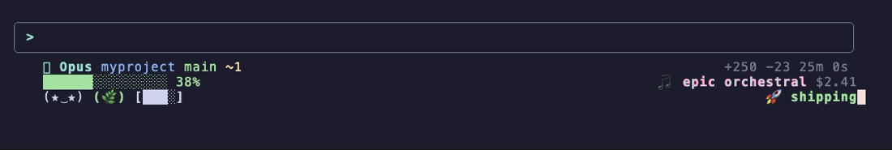

# oh-my-claude

[](https://www.npmjs.com/package/@npow/oh-my-claude)
[](https://github.com/npow/oh-my-claude/actions/workflows/ci.yml)
[](LICENSE)

**Your Claude Code session is invisible. oh-my-claude makes it visible.**

Context window filling up? You won't know until Claude gets confused. Burning $15/hour? No indicator. CI failed after your last push? Switch to a browser to find out. Dev server crashed? You'll debug for 10 minutes before noticing.

oh-my-claude puts all of this in your statusline:

```
 Opus myproject main ↑2  ✓ CI  2h ago                   5h 12% ~4h30m $0.36/m
 ▓▓▓▓▓▓▓░░░░░░░░░░░░░ 35%  ● :3000                          $1.23  15m 0s
```



## Install

```bash
npm install -g @npow/oh-my-claude
omc install
```

Two commands. Takes effect immediately.

87 plugins. 12 themes. Zero npm dependencies. [Write your own](#write-your-own-plugin) in minutes.

---

## What can it show?

**Know when you're running out** -- context bar turns yellow at 60%, red at 80%:

```diff
  ▓▓▓▓▓▓░░░░░░░░░ 30%     ← green
! ▓▓▓▓▓▓▓▓▓░░░░░░ 60%     ← yellow
- ▓▓▓▓▓▓▓▓▓▓▓▓░░░ 80%     ← red, time to /compact
```

**Know what you're spending** -- cost rate, per-line cost, usage limits:

```
$0.36/m  $4.56  3¢/line  5h 12% ~4h30m | 7d 30%
```

**Know if your stuff is working** -- dev server, CI, PR status:

```
● :3000  ✓ CI  PR #42 ✓ approved  3 reviews
```

**Or just have fun** -- virtual pets, RPG stats, fortune cookies:

```
(^.^) Lv.9 STR:18 DEX:4  🔥 7d streak  🥠 "Ship it." — @chad
```

---

## Themes

```bash
omc theme <name>
```

| Theme | What it's for |
|-------|---------------|
| **default** | Clean two-line: git, context bar, cost |
| **minimal** | Single line, text only |
| **analytics** | Usage limits, cost rate, efficiency, context ETA |
| **devops** | Localhost health, CI status, PR reviews, uncommitted diff |
| **productivity** | Clock, work/break cycle, day progress |
| **powerline** | Nerd Font icons and arrows |
| **tamagotchi** | Virtual pet, garden, coffee, vibes |
| **rpg** | D&D stats, speedrun, cat, horoscope |
| **boss-battle** | Dungeon crawl, battle music |
| **coworker** | Fake Slack messages, fortune cookies |
| **narrator** | Third-person text adventure |
| **danger-zone** | Everything on fire |

See [screenshots](#screenshots) below.

---

## All 87 plugins

Everything ships in the box. Just `omc add <name>`. Plugins that need external tools hide gracefully if the tool isn't installed.

<details>
<summary><strong>Usage limits & cost</strong> (19 plugins)</summary>

| Plugin | Example | Needs |
|--------|---------|-------|
| `usage-limits` | `5h 12% ~4h30m \| 7d 30%` | Chrome |
| `context-bar` | `██████░░░░░░░░░ 38%` | |
| `context-percent` | `38%` | |
| `context-tokens` | `84k/200k` | |
| `context-remaining` | `115k left` | |
| `context-eta` | `ETA 22m` | |
| `context-level` | `↑↑` | |
| `compact-hint` | `/compact` | |
| `token-sparkline` | `▁▂▃▄▅▆▇█` | |
| `session-cost` | `$2.41` | |
| `cost-budget` | `$3.50/$10.00` | |
| `cost-rate` | `$0.36/m` | |
| `cost-per-line` | `3¢/line` | |
| `cost-gauge` | `$4.56 ▅` | |
| `tokens-per-dollar` | `18k tok/$` | |
| `input-output-ratio` | `6.5:1 i/o` | |
| `token-rate` | `7.2k tok/m` | |
| `efficiency-score` | `14 L/m` | |
| `smart-nudge` | `💡 /compact` | |

</details>

<details>
<summary><strong>Dev environment</strong> (7 plugins)</summary>

| Plugin | Example | Needs |
|--------|---------|-------|
| `localhost` | `● :3000` / `○ :3000` | |
| `ci-status` | `✓ CI` / `✗ CI` | `gh` |
| `github-pr` | `PR #42 ✓ approved` | `gh` |
| `pr-reviews` | `3 reviews` | `gh` |
| `process-watcher` | `● vite ● jest` | |
| `log-tail` | Last error from log | |
| `session-diff` | `3f +120 -45` | |

</details>

<details>
<summary><strong>Git</strong> (6 plugins)</summary>

| Plugin | Example |
|--------|---------|
| `git-branch` | `main` |
| `git-status` | `+2 ~1 ?3` |
| `git-stash` | `stash:3` |
| `git-ahead-behind` | `↑2 ↓1` |
| `git-last-commit` | `2h ago` |
| `git-tag` | `v1.2.3` |

</details>

<details>
<summary><strong>Session & time</strong> (18 plugins)</summary>

| Plugin | Example |
|--------|---------|
| `model-name` | `Opus` |
| `directory` | `myproject` |
| `package-version` | `v0.3.1` |
| `session-timer` | `25m 0s` |
| `api-timer` | `api 3m 40s` |
| `think-timer` | `you 9m 30s` |
| `lines-changed` | `+250 -23` |
| `lines-gauge` | `▄ 104L` |
| `vim-mode` | `NORMAL` |
| `version` | `v2.1.34` |
| `clock` | `2:30pm` |
| `date-display` | `Feb 20` |
| `day-progress` | `▓▓▓▓▓░░░░░` |
| `week-progress` | `Wed ▓▓▓░░` |
| `year-progress` | `14% of 2026` |
| `countdown` | `launch in 12d` |
| `work-cycle` | `🍅 13m` / `☕ break` |
| `break-reminder` | `take a break` |

</details>

<details>
<summary><strong>System</strong> (5 plugins)</summary>

| Plugin | Example | Needs |
|--------|---------|-------|
| `spotify` | `♫ Daft Punk — Get Lucky` | macOS or `playerctl` |
| `cpu` | `cpu 12%` | |
| `battery` | `🔋 85%` | laptop |
| `weather` | `⛅ 72°F` | |
| `hackernews` | `▲847 Show HN: ...` | |

</details>

<details>
<summary><strong>Fun & gamification</strong> (30 plugins)</summary>

| Plugin | Example |
|--------|---------|
| `tamagotchi` | `(^.^)` happy, `(x_x) RIP` |
| `cat` | `=^._.^= *sits on context window*` |
| `vibe-check` | `vibing`, `burning cash` |
| `fortune-cookie` | `"Weeks of coding..."` |
| `narrator` | `The walls close in...` |
| `soundtrack` | `lo-fi beats` |
| `garden` | `(.)` → `(🌳)` |
| `coffee-cup` | `[████]` → `[    ]` |
| `horoscope` | `Mercury is in retrograde.` |
| `coworker` | `@chad: 'ship it'` |
| `commit-msg` | `git commit -m "feat: ..."` |
| `weather-report` | `Clear Skies` / `Stormy` |
| `dad-joke` | `Why do programmers...` |
| `magic-8ball` | `🎱 Outlook good` |
| `compliment` | `Your git history is art` |
| `mood-ring` | `💚` / `💛` / `❤️` |
| `loading-spinner` | `⠋` |
| `achievement` | `Centurion` at 100 lines |
| `rpg-stats` | `Lv.9 STR:18 DEX:4` |
| `xp-bar` | `Lv3 █░░░░░░░ 58xp` |
| `level` | `Journeyman` → `Legend` |
| `combo-meter` | `x3 SUPER` |
| `boss-health` | `CONTEXT [████░░] 58%` |
| `quest-log` | `⚔️ Survive the limit` |
| `loot-drop` | `🟢 Rubber Duck+1` |
| `speedrun` | `47:00 [C]` |
| `streak` | `🔥 7d streak` |
| `battle-log` | `Boss Battle (85%)` |
| `stock-ticker` | `$OMC ▲▲ $4.56` |
| `emoji-story` | `📝✏️🏗️💰⏳` |

</details>

<details>
<summary><strong>Layout</strong> (6 plugins)</summary>

`separator-pipe` `separator-arrow` `separator-space` `flex-space` `custom-text` `output-style`

</details>

---

## Customize

```bash
omc add spotify                    # add a plugin
omc add localhost --line 2         # pick position
omc config localhost port=8080     # configure it
omc set 1 --left model-name git-branch --right session-cost
omc show                           # preview your layout
omc theme save my-setup            # save as a theme
```

---

## Write your own plugin

```js
// ~/.claude/oh-my-claude/plugins/my-plugin/plugin.js
export const meta = {
  name: 'my-plugin',
  description: 'Shows something useful',
  defaultConfig: { style: 'cyan' },
};

export function render(data, config) {
  const value = data?.cost?.total_cost_usd;
  if (value == null) return null;
  return { text: `$${value.toFixed(2)}`, style: config.style };
}
```

Three rules: export `meta`, export `render`, return `{ text, style }` or `null`.

```bash
omc create my-plugin        # scaffold it
omc test my-plugin           # test with mock data
omc add my-plugin            # activate it
```

Script plugins work too (Python, Bash, etc.) -- `omc create my-plugin --script`.

Full API reference: [docs/plugin-contract.md](docs/plugin-contract.md)

---

## CLI

```
omc install                  Setup wizard
omc show                     Current layout + preview
omc add/remove <name>        Toggle plugins on the statusline
omc set <line>               Set a line (--left p1 p2 --right p3)
omc theme <name>             Switch theme
omc theme save <name>        Save current layout as theme
omc config <name>            Show/set plugin config
omc info <name>              Plugin details
omc test <name>              Test a plugin with mock data
omc list                     All plugins
omc doctor                   Diagnose issues
omc create <name>            Scaffold a new plugin
omc install <url>            Install community plugin from git
```

---

## Screenshots

### `default`


### `tamagotchi`


### `boss-battle`


### `rpg`


### `coworker`


### `narrator`


### `danger-zone`


---

## Requirements

- Node 18+ (ships with Claude Code)
- Zero npm dependencies

## Contributing

PRs welcome. One file per plugin, export `meta` + `render`, handle nulls, run `npm run validate`.

## License

MIT
